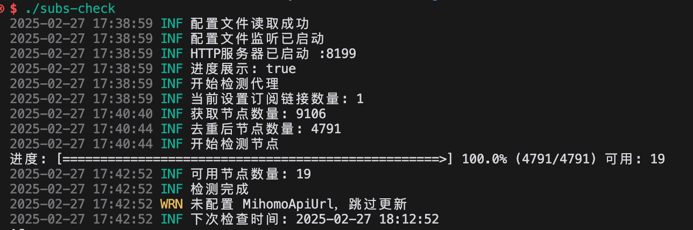
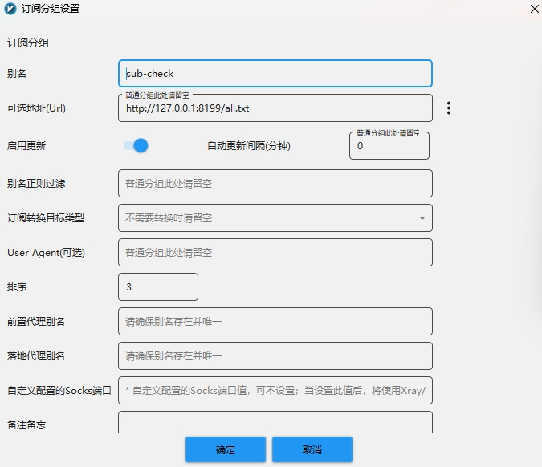

# 订阅合并转换检测工具

## 原项目

- https://github.com/bestruirui/BestSub
- https://github.com/beck-8/subs-check

## 预览



## 功能

- config.yaml文件监听
- 检测节点可用性,去除不可用节点
- 合并多个订阅
- 将订阅转换为clash/mihomo/base64格式
- 节点去重
- 节点重命名
- 节点测速
- 外部拉取结果（默认监听 :8199）

## 修改内容

- 移除MihomoApi更新订阅功能
- 移除 GitHub Container Registry 发布配置
- Docker Hub 镜像发布
- 移除config.example.yaml中worker-url和worker-token内容
- 移除config.example.yaml中mihomo-api-url和mihomo-api-secret内容
- 移除config.go中MihomoApiUrl和MihomoApiSecret字段
- 移除updatesubs.go中getversion字段

## 保存方式

- 本地
- Gist

## 适配订阅格式

- mihomo
- base64

## TODO

- 生成sing-box订阅

## 使用方法

- 1.Docker部署
- 2.进入主机文件夹./subs-check/config，找到config.yaml
- 3.将config.yaml中的sub-urls下的example.com替换为你的订阅链接
- 4.保存config.yaml文件
- 5.重新运行docker容器

> 如果拉取订阅速度慢，可使用通用的 `HTTP_PROXY` `HTTPS_PROXY` 环境变量加快速度；此变量不会影响节点测试速度

### docker运行

```bash
docker run -d --name subs-check -p 8299:8199 -v ./subs-check/config:/app/config  -v ./subs-check/output:/app/output --restart always li5bo5/subs-check:latest
```

### docker-compose

```yaml
version: "3"
services:
  mihomo-check:
    image: li5bo5/subs-check:latest
    container_name: subs-check
    volumes:
      - ./subs-check/config:/app/config
      - ./subs-check/output:/app/output
    ports:
      - "8299:8199"
    environment:
      - TZ=Asia/Shanghai
    restart: always
    tty: true
    network_mode: bridge
```
### 源码直接运行

```bash
go run main.go -f /path/to/config.yaml
```

### 二进制文件运行

直接运行即可,会在当前目录生成配置文件

## 保存方法配置

- 本地保存: 将结果保存到本地,默认保存到可执行文件目录下的 output 文件夹
- gist: 将结果保存到 github gist [配置方法](./doc/gist.md)

## 对外提供服务配置
- `http://127.0.0.1:8299/all.yaml` 返回yaml格式节点
- `http://127.0.0.1:8299/all.txt` 返回base64格式节点

可以直接将base64格式（all.txt）订阅放到V2rayN中


## 订阅使用方法

原作者推荐直接裸核运行 tun 模式 

原作者写的Windows下的裸核运行应用 [minihomo](https://github.com/bestruirui/minihomo)

- 下载[base.yaml](./doc/base.yaml)
- 将文件中对应的链接改为自己的即可
- 只修改一个url的内容，然后这个base.yaml当作本地订阅文件导入OpenClash，就可以用了

例如:

```yaml
proxy-providers:
  ProviderALL:
    url: _http://127.0.0.1:8299/all.yaml_ #将此处替换为自己的链接
    type: http
    interval: 600
    proxy: DIRECT
    health-check:
      enable: true
      url: http://www.google.com/generate_204
      interval: 60
    path: ./proxy_provider/ALL.yaml
```